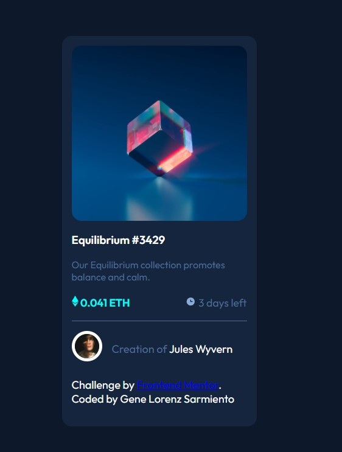

# Frontend Mentor - NFT preview card component solution

This is a solution to the [NFT preview card component challenge on Frontend Mentor](https://www.frontendmentor.io/challenges/nft-preview-card-component-SbdUL_w0U). Frontend Mentor challenges help you improve your coding skills by building realistic projects.

## Table of contents

- [Frontend Mentor - NFT preview card component solution](#frontend-mentor---nft-preview-card-component-solution)
  - [Table of contents](#table-of-contents)
  - [Overview](#overview)
    - [The challenge](#the-challenge)
    - [Screenshot](#screenshot)
    - [Links](#links)
    - [Built with](#built-with)
    - [What I learned](#what-i-learned)
    - [Useful resources](#useful-resources)
  - [Author](#author)
  - [Acknowledgments](#acknowledgments)

**Note: Delete this note and update the table of contents based on what sections you keep.**

## Overview

### The challenge

Users should be able to:

- View the optimal layout depending on their device's screen size
- See hover states for interactive elements

### Screenshot



### Links

- Solution URL: [Add solution URL here](https://www.frontendmentor.io/solutions/nft-preview-card-component-by-gene-lorenz-24YDcPIjB)

- Live Site URL: [Live](https://nft-preview-card-component-main-glsarm.vercel.app/)

### Built with

- Semantic HTML5 markup
- CSS custom properties
- Flexbox
- Mobile-first workflow

### What I learned

I remember about CSS resets

```css
*,
*::before,
*::after {
  box-sizing: border-box;
}
/*and*/
body {
  margin: 0;
  height: calc(100vh - 1px);
}
```

If you want more help with writing markdown, we'd recommend checking out [The Markdown Guide](https://www.markdownguide.org/) to learn more.

### Useful resources

- [Scrimba's build your space travel by Kevin Powell](https://www.scrimba.com/learn/spacetravel) - This helped me to remember resets in css

## Author

- Frontend Mentor - [@genelorenzSarmiento0408](https://www.frontendmentor.io/profile/genelorenzSarmiento0408)
- Twitter - [@sarmientgene](https://www.twitter.com/sarmientgene)

## Acknowledgments

Thank you Grumpy and Christian on Scrimba's Discord for helping me with this challenge.
